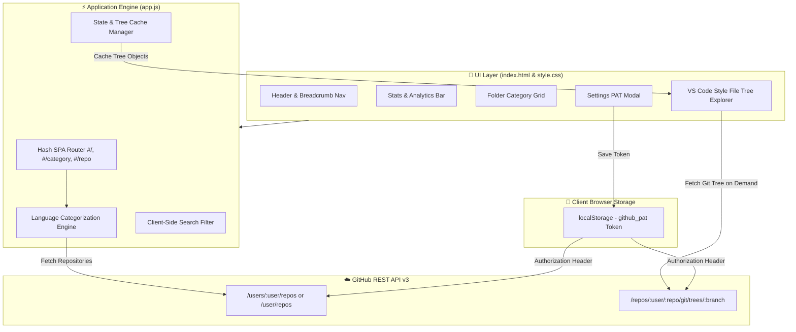
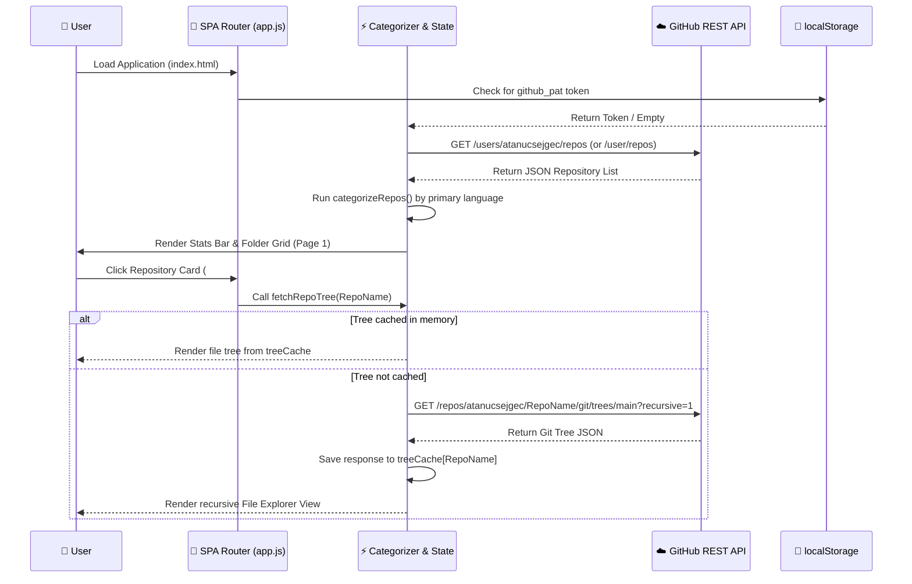
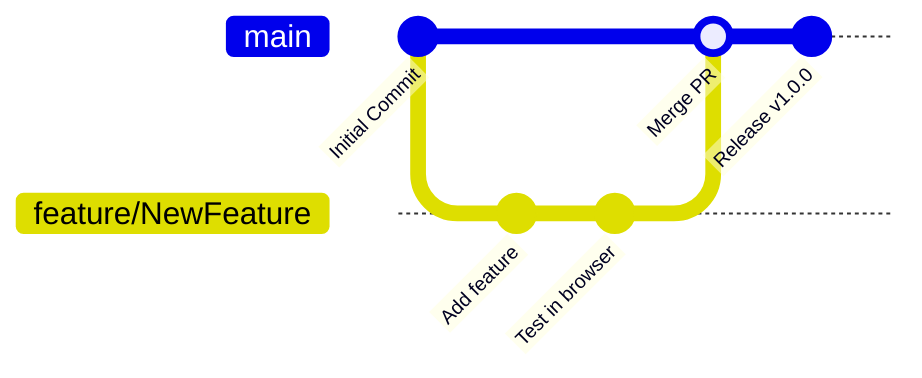

<div align="center">


<br/>

[](https://git.io/typing-svg)

<br/>

[](https://developer.mozilla.org/en-US/docs/Web/HTML)
[](https://developer.mozilla.org/en-US/docs/Web/CSS)
[](https://developer.mozilla.org/en-US/docs/Web/JavaScript)
[](https://docs.github.com/en/rest)
[](LICENSE)
[](https://github.com/atanucsejgec/GitHub_Repository_Organizer/stargazers)
[](https://github.com/atanucsejgec/GitHub_Repository_Organizer/issues)
[](https://github.com/atanucsejgec/GitHub_Repository_Organizer/commits)
[](https://atanucsejgec.github.io/GitHub_Repository_Organizer/)

<br/>

> 📂 **GitHub Repository Organizer** is a sleek, browser-based web application that organizes and categorizes GitHub repositories by primary programming language and project type — complete with IDE-style file trees, instant search, PAT authentication for private repos, and dynamic repository analytics with zero build tool dependencies.

<br/>

[🌐 Website Link](https://atanucsejgec.github.io/GitHub_Repository_Organizer/) • [⚙️ Getting Started](#️-getting-started) • [✨ Features](#-features) • [🎯 Why Repository Organizer?](#-why-repository-organizer) • [📁 Structure](#-project-structure) • [🤝 Contribute](#-contributing)

</div>

---

## 📖 Table of Contents

- [📌 About](#-about)
- [🎯 Why Repository Organizer?](#-why-repository-organizer)
- [📸 Screenshots](#-screenshots)
- [✨ Features](#-features)
- [🛠️ Tech Stack](#️-tech-stack)
- [🏗️ Architecture](#️-architecture)
- [⚙️ Getting Started](#️-getting-started)
- [📁 Project Structure](#-project-structure)
- [🗺️ Roadmap](#️-roadmap)
- [🤝 Contributing](#-contributing)
- [👥 Contributors](#-contributors)
- [📄 License](#-license)
- [📬 Contact](#-contact)

---

## 📌 About

**GitHub Repository Organizer** transforms the standard list of GitHub repositories into an interactive, file-manager style workspace. It dynamically fetches repositories for any target GitHub user via the GitHub REST API and organizes them into language-based folder structures (Python, Kotlin, Web, C++, TypeScript, Rust, Go, etc.).

Users can explore individual project file trees directly inside the browser using an IDE-inspired explorer, perform live multi-field searches, access live deployment links, and manage GitHub Personal Access Tokens (PAT) for private repo access and expanded rate limits — **100% inside your browser with zero backend server dependencies**.

---

### 🎯 Why Repository Organizer?

<table>
  <tr>
    <td align="center">📁</td>
    <td><b>Categorized Folder View</b></td>
    <td>Automatically groups repositories into intuitive folders based on primary language (Android & Kotlin, Web, Python, C++, TypeScript, Go, Rust, and more).</td>
  </tr>
  <tr>
    <td align="center">🌳</td>
    <td><b>VS Code-Style Tree Explorer</b></td>
    <td>Inspect recursive directory trees and file sizes of any repository live inside the browser without cloning code locally.</td>
  </tr>
  <tr>
    <td align="center">⚡</td>
    <td><b>Instant Search & Filtering</b></td>
    <td>Filter across repository names, descriptions, primary languages, and file trees in real time with instant UI feedback.</td>
  </tr>
  <tr>
    <td align="center">🔑</td>
    <td><b>GitHub PAT Integration</b></td>
    <td>Add a GitHub Personal Access Token via the Settings modal to browse private repositories and increase API limits from 60 to 5,000 requests/hr. Stored safely in <code>localStorage</code>.</td>
  </tr>
  <tr>
    <td align="center">🔗</td>
    <td><b>Direct Live Demos & APKs</b></td>
    <td>Instant access links to GitHub Pages deployments, web app hostings, and release binaries per repository card.</td>
  </tr>
  <tr>
    <td align="center">📊</td>
    <td><b>Dynamic Analytics Bar</b></td>
    <td>Header statistics bar detailing total repositories, public vs. private counts, star counts, and category metrics.</td>
  </tr>
  <tr>
    <td align="center">🎨</td>
    <td><b>Modern Glassmorphic Dark UI</b></td>
    <td>Rich dark aesthetics with custom glowing accents, smooth hover micro-animations, language color tags, and responsive layouts.</td>
  </tr>
  <tr>
    <td align="center">🚀</td>
    <td><b>Zero Dependencies & No Build Step</b></td>
    <td>Runs directly as a static Single Page Application (SPA) using pure Vanilla HTML5, CSS3, and ES6+ JavaScript.</td>
  </tr>
</table>

---

## 📸 Screenshots

> 💡 A modern file manager UI designed for browsing repositories with speed and clarity.

<div align="center">

  ### 📁 Category Folders & Quick Access Tree
  <br>
  

  <br><br>

  ### 🌳 Repository Recursive File Explorer
  <br>
  

</div>

---

## ✨ Features

<table>
  <tr>
    <td>📁 <b>Automatic Language Grouping</b></td>
    <td>Categorizes repos into Android & Kotlin, Web, Python, TypeScript, C++, C, C#, Go, Rust, Ruby, Swift, Dart, Shell, and Empty/README categories</td>
  </tr>
  <tr>
    <td>🌳 <b>Recursive Git File Explorer</b></td>
    <td>Fetch and render repository file trees using the GitHub Git Trees API with expand/collapse folder capabilities and human-readable file sizes</td>
  </tr>
  <tr>
    <td>🔎 <b>Instant Multi-Field Search</b></td>
    <td>Real-time client-side search filtering repository titles, descriptions, and file nodes</td>
  </tr>
  <tr>
    <td>🔐 <b>PAT Authentication & Rate Limit Expansion</b></td>
    <td>Bypass public API rate limits (up to 5,000 req/hr) and inspect private repositories using a Personal Access Token stored securely in browser <code>localStorage</code></td>
  </tr>
  <tr>
    <td>🧭 <b>Hash SPA Router & Breadcrumb Navigation</b></td>
    <td>Seamless back/forward browser navigation using hash routes (<code>#/</code>, <code>#/category/:name</code>, <code>#/repo/:name</code>) and dynamic breadcrumbs</td>
  </tr>
  <tr>
    <td>📊 <b>Header Metrics & Statistics Chips</b></td>
    <td>Dynamic counters summarizing total repos, public/private breakdown, total stars earned, and category counts</td>
  </tr>
  <tr>
    <td>🏷️ <b>Language-Specific Iconography & Colors</b></td>
    <td>Color-coded language tags matching official GitHub language color definitions and custom extension icons for files</td>
  </tr>
  <tr>
    <td>⚡ <b>Lazy Loading & Response Caching</b></td>
    <td>Trees are fetched only on demand when inspecting a repository and cached in memory to save network bandwidth and rate limit quota</td>
  </tr>
</table>

---

## 🛠️ Tech Stack

<div align="center">

[](https://skillicons.dev)

</div>

<br/>

| Category | Technology |
|---|---|
| 🏗️ Structure | HTML5 (Semantic Single-Page Application Layout) |
| 🎨 Styling | Vanilla CSS3 (Custom CSS Properties, Glassmorphism, Flexbox, Responsive Grid) |
| ⚡ Application Logic | Vanilla JavaScript (ES6 Modules, Hash Router, Fetch API, DOM Manipulation) |
| ✈️ API Integration | [GitHub REST API v3](https://docs.github.com/en/rest) (Users, Repositories, Git Trees) |
| 💾 Local State | Browser `localStorage` engine for GitHub Personal Access Tokens |

---

## 🏗️ Architecture

GitHub Repository Organizer runs completely on the client side without intermediate servers or complex backend build steps.

### 📐 Application Flow



### 🔄 Data Hydration & Tree Explorer Pipeline



---

## ⚙️ Getting Started

### Prerequisites

- ✅ Any modern web browser (Chrome, Firefox, Edge, Safari)
- ✅ Git installed on your system (optional for cloning)
- 💡 (Optional) GitHub Personal Access Token for private repo access & higher API rate limit

### Quick Start

**1. Clone the repository**

```bash
git clone https://github.com/atanucsejgec/GitHub_Repository_Organizer.git
cd GitHub_Repository_Organizer
```

**2. Open locally**

Because this project is built using standard HTML, CSS, and JS, **no `npm install` or build step is needed!**

Simply open `index.html` directly in your browser, or serve it using any simple static web server:

```bash
# Using Python
python -m http.server 8000

# Using Node npx serve
npx serve .
```

**3. Open in Browser**

Navigate to `http://localhost:8000` (or double click `index.html`).

---

## 📁 Project Structure

```
GitHub_Repository_Organizer/
│
├── 📄 index.html              # Main SPA HTML structure (header, stats, modal, container)
├── 📄 app.js                  # Application engine (API calls, router, categories, tree view)
├── 📄 style.css               # Design system (variables, glassmorphism, responsive grid)
└── 📄 README.md               # Application documentation
```

---

## 2. Roadmap

```mermaid
graph LR
    subgraph DONE["✅ Completed"]
        A[Zero-Dependency SPA Architecture]
        B[Language-Based Folder Categorization]
        C[VS Code Style Recursive File Explorer]
        D[GitHub PAT Auth & Rate Limit Booster]
        E[Hash Router & Dynamic Breadcrumbs]
        F[Live Search & Contextual Filtering]
        G[Responsive Glassmorphic Dark UI]
    end

    subgraph PLAN["📋 Planned"]
        H[In-App Code & Markdown Viewer Modal]
        I[Multi-User Profile Lookup Bar]
        J[IndexedDB Cache for Offline Browsing]
        K[Export Repository List as JSON/Markdown]
    end

    DONE --> PLAN
```



| Status | Feature |
|---|---|
| ✅ Done | Pure Vanilla HTML/CSS/JS architecture with zero framework overhead |
| ✅ Done | Automatic categorization into language folders (Python, Web, Kotlin, C++, etc.) |
| ✅ Done | IDE-style recursive file tree viewer using GitHub Git Trees API |
| ✅ Done | Personal Access Token (PAT) support via Settings modal for private repos |
| ✅ Done | Client-side Hash Router (`#/`, `#/category/:id`, `#/repo/:name`) with breadcrumbs |
| ✅ Done | Header stats bar displaying total repos, public/private counts, and star totals |
| ✅ Done | Instant search bar filtering repos, descriptions, and file nodes |
| 📋 Planned | Syntax-highlighted code & Markdown file preview modal |
| 📋 Planned | Profile search input to explore any public GitHub user's repositories |
| 📋 Planned | IndexedDB caching engine for offline tree browsing |
| 📋 Planned | One-click export of repository portfolio as Markdown / JSON |

---

## 🤝 Contributing

Contributions, bug reports, and feature suggestions are always welcome! 🚀



1. **Fork** the repository
2. **Create** your feature branch:
   ```bash
   git checkout -b feature/AmazingFeature
   ```
3. **Commit** your changes:
   ```bash
   git commit -m 'feat: Add some AmazingFeature'
   ```
4. **Push** to the branch:
   ```bash
   git push origin feature/AmazingFeature
   ```
5. **Open** a Pull Request 🎉

### 📋 Guidelines

- Keep code clean and modular in **Vanilla JavaScript (ES6)** — avoid introducing heavy frameworks unless necessary.
- Ensure all styling aligns with the custom dark CSS variables defined in `style.css`.
- Follow conventional commit messages (`feat:`, `fix:`, `docs:`, `style:`).

---

## 👥 Contributors

<div align="center">

[](https://github.com/atanucsejgec/GitHub_Repository_Organizer/graphs/contributors)

*Made with [contrib.rocks](https://contrib.rocks)*

</div>

---

## 📄 License

Distributed under the **MIT License**. See [`LICENSE`](LICENSE) for more information.

```text
MIT License

Copyright (c) 2026 Atanu Biswas

Permission is hereby granted, free of charge, to any person obtaining a copy
of this software and associated documentation files (the "Software"), to deal
in the Software without restriction...
```

---

## 📬 Contact

<div align="center">

**Atanu Biswas**

[](https://github.com/atanucsejgec)
[](https://github.com/atanucsejgec/GitHub_Repository_Organizer)

📌 **Repository Link:** [https://github.com/atanucsejgec/GitHub_Repository_Organizer](https://github.com/atanucsejgec/GitHub_Repository_Organizer)

🌐 **Live Website:** [https://atanucsejgec.github.io/GitHub_Repository_Organizer/](https://atanucsejgec.github.io/GitHub_Repository_Organizer/)

</div>

---

<div align="center">

### ⭐ If GitHub Repository Organizer helps you, please consider giving it a star! ⭐


</div>
